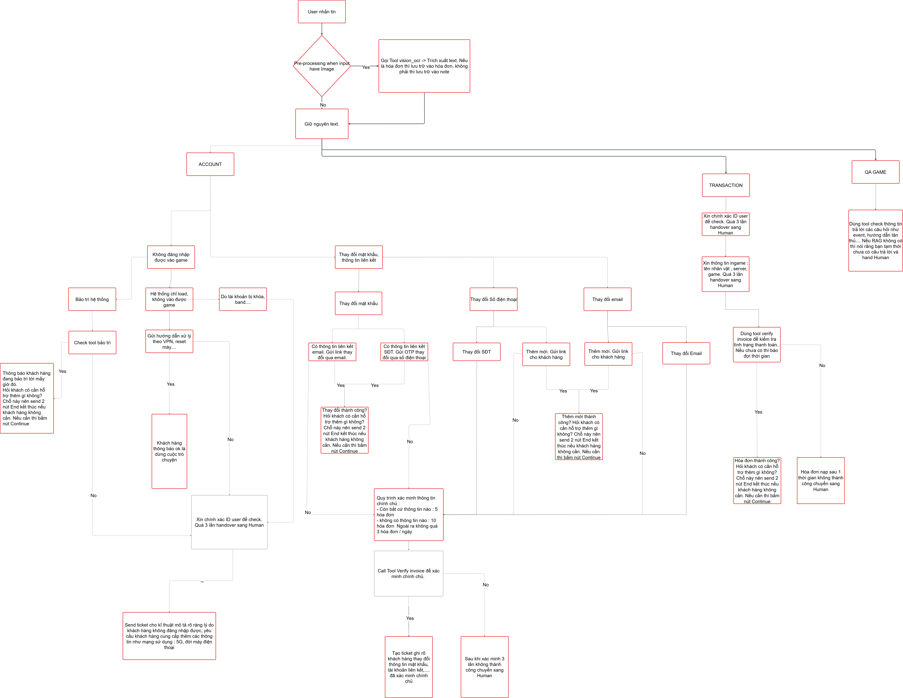

# CSKH Game System (AI-Powered Support Agent)

Hệ thống AI Agent tự động hỗ trợ chăm sóc khách hàng chuyên biệt cho lĩnh vực Game. Hệ thống tích hợp xử lý hình ảnh (OCR), xác minh danh tính người dùng qua hóa đơn giao dịch và tra cứu thông tin sự kiện thời gian thực (RAG).

## 🚀 Tính năng chính

- **Phân loại yêu cầu tự động (Router):** Nhận diện và chuyển hướng yêu cầu vào các nhánh ACCOUNT, TRANSACTION hoặc QA GAME.
- **Xác minh chính chủ qua hóa đơn:** Quy trình kiểm tra 5-10 hóa đơn nạp tiền để xác minh quyền sở hữu tài khoản.
- **Hệ thống "Trạm gác" (Guards):** Kiểm tra trạng thái bảo trì và xác thực User ID trước khi can thiệp nghiệp vụ.
- **Hỗ trợ hỏi đáp thông minh (RAG):** Tra cứu thông tin sự kiện (Event) và hướng dẫn tân thủ từ cơ sở dữ liệu tri thức.

## 🛠 Tech Stack

- **Framework:** Python, LangChain/CrewAI.
- **Database:** - **MongoDB:** Lưu trữ Chat History và Ticket (Dự án cá nhân chạy Local hoặc Cloud Atlas).
  - **MySQL (Game DB):** Đối soát thông tin nạp và tài khoản qua API.
  - **Redis:** Quản lý Session và trạng thái hội thoại.
- **AI Tools:** Vision OCR (Triton/OpenAI), RAG Engine.

## 📊 Sơ đồ hệ thống


*(Xem chi tiết logic nghiệp vụ tại [Logic Documentation](docs/README_logic.md))*

## 📂 Cấu trúc dự án (Project Tree)

```text
cskh-game-system/
├── main.py                     # Khởi chạy FastAPI
├── .env
├── requirements.txt
│
├── cskhgamesystem/               # [PROJECT PACKAGE]
│   ├── __init__.py
│   │
│   ├── core/                   # Những thứ dùng chung toàn hệ thống
│   │   ├── base_agent.py       # Lớp trừu tượng cho AI
│   │   ├── config.py           # Đọc file .env
│   │   └── security/           # Logic bảo mật dùng chung
│   │       ├── filter.py       # Regex lọc OTP, Pass (Dọn dẹp data)
│   │       └── validator.py    # Kiểm tra tính hợp lệ của request
│   │
│   ├── shared/                 # Dịch vụ nền (Infrastructure)
│   │   ├── database.py         # Kết nối Mongo/Redis
│   │   ├── memory.py           # Quản lý Session
│   │   └── ticket_service.py   # Hệ thống đẩy Ticket sang Human
│   │
│   ├── modules/                # [CÁC MODULE TÍNH NĂNG - TỰ TRỊ]
│   │   │
│   │   ├── gateway/            # Module tiếp nhận & điều hướng
│   │   │   ├── api.py          # Endpoint tiếp nhận chat từ App
│   │   │   ├── router.py       # Logic điều hướng session
│   │   │   ├── classifier.py   # Small Intent Check
│   │   │   └── prompt_heading.txt
│   │   │
│   │   ├── payment/            # Module Nạp tiền (Gói gọn từ A-Z)
│   │   │   ├── agent.py        # Logic AI xử lý nạp tiền
│   │   │   ├── repo.py         # Truy vấn DB giả lập (Port 8001)
│   │   │   ├── schema.py       # Định dạng JSON đầu ra riêng cho Payment
│   │   │   └── prompt_payment.txt
│   │   │
│   │   ├── account/            # Module Lỗi tài khoản
│   │   │   ├── agent.py
│   │   │   ├── repo.py
│   │   │   ├── schema.py
│   │   │   └── prompt_account.txt
│   │   │
│   │   └── knowledge/          # Module Hỏi đáp (RAG)
│   │       ├── agent.py
│   │       ├── rag_engine.py
│   │       └── prompt_qa.txt
│   │
│   └── utils/                  # Tiện ích bổ trợ (Helpers)
│       ├── image_proc.py
│       └── logger.py
│
└── data_user_game_api/                # [HỆ THỐNG GIẢ LẬP GAME - ĐỘC LẬP]
    ├── server.py               # API Port 8001
    ├── game_data.db            # SQLite
    ├── init_db.py              # Tạo data mẫu
    └── models.py               # SQLAlchemy models cho SQLite
```